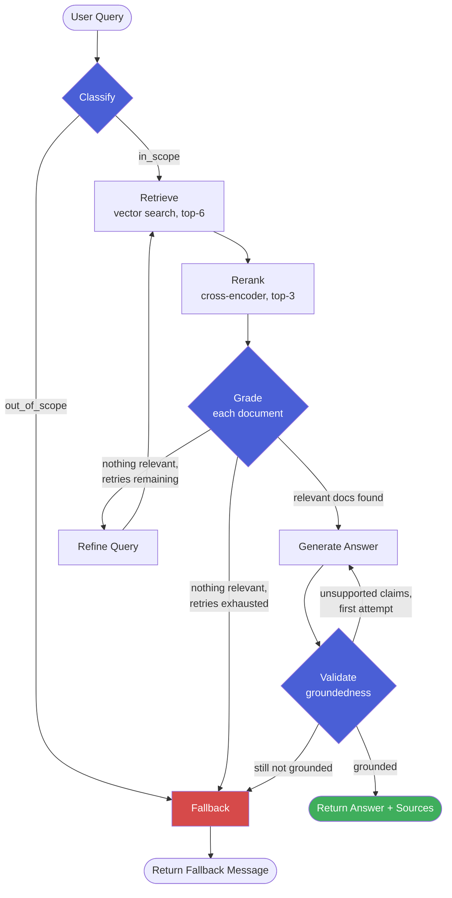

<div align="center">


[](https://github.com/nilay007hckkr/Minty/actions/workflows/ci.yml)


</div>

## What this is

A banking-FAQ chatbot that answers **only** from a bank's own published content, using an **agentic corrective-RAG pipeline** instead of a single retrieve-then-generate chain. It doesn't just fetch documents and hope for the best — it classifies whether a query is even in scope, reranks retrieved candidates with a cross-encoder, grades each document's relevance individually, rewrites and retries the search when nothing relevant comes back, and fact-checks its own generated answer against the source material before ever showing it to a user.

Every one of those steps exists because a simpler version of this system was tested against real (if synthetic) banking content and found to have a real failure mode — not because a tutorial said to add it.

## Table of contents

- [Why this isn't naive RAG](#why-this-isnt-naive-rag)
- [Baseline comparison](#baseline-comparison)
- [Architecture](#architecture)
- [Tech stack](#tech-stack)
- [Features](#features)
- [Project structure](#project-structure)
- [Getting started](#getting-started)
- [Usage](#usage)
- [Observability](#observability)
- [Evaluation](#evaluation)
- [Known limitations](#known-limitations)
- [Roadmap](#roadmap)

## Why this isn't naive RAG

A plain RAG chain is: embed query → vector search → stuff top-k into a prompt → generate. That's fast to build and fails silently in ways that matter for something answering questions about money:

- It can't tell "irrelevant document I happened to retrieve" from "genuinely relevant document" — so noisy top-k results end up cited as sources for facts they don't support.
- It has no fallback when retrieval simply misses — it just generates from whatever came back, relevant or not.
- It has no check on the generated answer itself — an LLM can (and did, during development of this project) invent a plausible-sounding but unsupported detail, like expanding an abbreviation the source never defined.

This project's graph adds a corrective step for each of those failure modes, and each one was validated against a real, reproduced failure — not added speculatively.

### Baseline comparison

Rather than just claim this architecture is better than naive RAG, I built two stripped-down versions of the same graph — reusing the exact same node functions, just fewer of them — and ran the identical 12-question eval set against all three:

| System | Score | What actually happens |
|---|---|---|
| Naive RAG (retrieve → generate) | 8/12 | Answers all 8 in-scope questions, but confidently answers all 4 out-of-scope questions (e.g. "what's your favorite color") by generating from whatever's nearest in vector space and citing it as a source — has no concept of "nothing here is relevant." |
| Reranked RAG (+ cross-encoder) | 8/12 | Same 4 scope failures as naive RAG. Reranking changes *which* documents get cited but adds no scope check. |
| Minty (full pipeline) | 12/12 | Classification rejects all 4 out-of-scope queries before retrieval runs; all 8 in-scope questions answered and validated. |

Identical scores across 3 runs on 2026-10-06, with the same 4 baseline failures each time. **On this eval set the whole gap between Minty and the baselines is scope handling.** All three systems answer the 8 in-scope questions. The grading and validation steps don't show up in these numbers; their value is measured separately (see [Evaluation](#evaluation)).

**How the account-opening failure was fixed (and why it was a chunking bug, not a reranker bug).** An earlier version scored Minty 11/12 and the reranked baseline 7/12. Both missed `"how do I open a new checking account"`. The cross-encoder ranked the chunk listing the ID/SSN/$50 requirements 4th of 6, so the top-3 cut dropped it. The obvious fix would have been raising `top_n`. Inspecting the chunks showed the real cause: `MarkdownHeaderTextSplitter` strips headers by default. So the chunk text never contained its own question ("What documents do I need to open a checking account?"), and that heading lived only in metadata, invisible to both the embedder and the cross-encoder. With headers kept in the chunk text, the target chunk for **every** in-scope eval question ranks #1 in both vector search and reranking. The account-opening chunk went from a cross-encoder score of −7.44 (rank 4) to +5.19 (rank 1). `top_n` stays at 3. The baselines share the same chunks, so the reranked baseline improved too (7 → 8).

The validator was also over-literal: it rejected the paraphrase "new checking account" as unsupported. Its prompt now checks factual claims (amounts, rates, times, eligibility, procedures, defined terms) and not wording. It returns a structured list of unsupported claims, and the generator gets one revision attempt that removes exactly those claims.

Reproduce this yourself: `uv run python -m tests.run_comparison_eval` (runs all three graphs directly, no server needed — makes real Groq calls, roughly 3x the cost of the standard eval since each question runs through all three pipelines).

## Architecture



Retry caps: 2 query refinements, and 1 revision after a failed validation. The revision only runs when the validator named specific unsupported claims, and the generator is told which ones to remove. Both caps are enforced in the routing logic, with a hard `recursion_limit` (25, worst-case path is 17 steps) on the graph as a safety net.

Classify, grade and validate use Groq's strict `json_schema` structured output (`app/schemas.py`). On gpt-oss this is constrained decoding, so labels can't come back as `"Yes."`, `"in-scope"`, or a verdict buried in free text.

Follow-up questions ("what about premium accounts?") are rewritten into a standalone question from the last 6 chat messages before the cache lookup and the graph run. Every node in this diagram is individually visible as a nested span in LangSmith — see [Observability](#observability).

## Tech stack

<div align="center">


</div>

| Layer | Choice | Why |
|---|---|---|
| Orchestration | LangGraph | Explicit stateful orchestration for the classify→retrieve→grade→**loop back**→generate→validate workflow, including conditional routing and bounded retry loops. |
| Generation LLM | Groq (`openai/gpt-oss-120b`) | Fast inference, generous free tier for a portfolio-scale demo. |
| Utility LLM | Groq (`openai/gpt-oss-20b`) | Cheaper/faster model for classify, grade, refine, and follow-up condensation — these are cheap decisions that don't need the bigger model. |
| Embeddings | `sentence-transformers/all-MiniLM-L6-v2` | Runs locally, no API cost or rate limit — important since embeddings get called on every query. |
| Reranker | `cross-encoder/ms-marco-MiniLM-L-6-v2` | Cross-encoders score query+document jointly for higher precision than vector similarity alone, used to cut top-6 candidates down to top-3 before grading. |
| Vector store | Chroma | Local, zero external services, good fit for a demo-scale corpus. |
| Cache / sessions / rate limiting | Redis | Fast in-memory structures fit all three needs: lists (history), key-value with TTL (response cache), and counters (rate limiting). All three are optional: if Redis is down, chat keeps working without cache/history and rate limiting falls back to an in-process counter. |
| Observability | LangSmith | Auto-instruments every LangGraph node as a nested trace — no manual span wrapping needed, just environment variables. |

## Features

- [x] Two-stage markdown-aware chunking (header-based splitting, then size-based); each chunk keeps its FAQ question heading in the text, so retrieval matches on it
- [x] Content-hash index sync on startup: new or edited chunks are added and stale ones removed, with no manual DB deletion
- [x] Query classification (in-scope vs. out-of-scope) before any retrieval work happens
- [x] Cross-encoder reranking between retrieval and grading
- [x] Per-document LLM relevance grading (not a single batch judgment)
- [x] Query refinement + retry loop on failed retrieval, capped at 2 attempts
- [x] Post-generation groundedness validation — checks the generated answer's factual claims against the retrieved sources, with one feedback-driven revision before falling back
- [x] Structured (strict JSON-schema) outputs for every LLM decision step
- [x] Multi-turn follow-ups via history-aware query condensation, plus Redis response caching (normalized exact match, see [Known limitations](#known-limitations)) and per-IP rate limiting, all degrading gracefully if Redis is unavailable
- [x] Input limits on `/chat` (query 1–500 chars after trimming, constrained `session_id`) → 422 before any LLM work
- [x] Fails fast during an LLM API outage: grading stops after two consecutive failures and skips the refine loop, and the user gets a "temporarily unavailable" message instead of "I don't know"
- [x] Lazy initialization: importing the app loads no models and creates no API clients, so the unit tests and CI need no API key
- [x] Full LangSmith tracing — every graph node visible as a nested span, tagged per session
- [x] Minimal same-origin HTML chat UI served via FastAPI static mount
- [x] Dockerized (FastAPI + Redis via Compose)
- [x] pytest suite with mocked LLM calls (fast, free, CI-safe) + a separate live eval harness (real API calls, run manually)
- [x] GitHub Actions CI (tests + Docker build on every push)
- [x] Baseline comparison against naive and reranked-only RAG variants, using the same eval set

## Project structure

```
app/
  main.py               FastAPI app: /chat, /health (reports Redis), rate limiting, response cache, trace metadata
  state.py              GraphState TypedDict shared across all graph nodes
  prompts.py             All prompt templates (classify, grade, refine, generate, revise, validate, condense)
  schemas.py             Pydantic schemas for structured classify/grade/validate output
  nodes.py               Node implementations + per-node error handling
  graph.py                StateGraph wiring: nodes, edges, conditional routing
  comparison_graphs.py    Naive and reranked-only graph variants for baseline comparison
  vectorstore.py         Embeddings + Chroma setup, content-hash index sync
  ingestion.py            Markdown loading + two-stage chunking
  rerank.py               Cross-encoder reranking
  history.py              Redis chat history (RPUSH / LRANGE)
  cache.py                Redis response cache (normalized-question exact match, shared across sessions)
  rate_limit.py           Redis fixed-window rate limiting
  redis_client.py         Shared Redis connection (host/port from env, for Docker networking)
static/
  index.html              Chat UI
sample_data/               Sample banking FAQ content (ATM fees, accounts, cards, wire transfers)
tests/
  test_graph.py            Mocked-LLM unit tests (no network calls)
  eval_set.json            Hand-built eval questions + expected outcomes
  run_eval.py              Live eval harness (invokes the graph directly, real Groq calls)
  run_comparison_eval.py   Runs eval_set.json directly against naive/reranked/full graphs
  run_validator_eval.py    Validator catch rate vs false-rejection rate on faithful/corrupted answers
.github/workflows/
  ci.yml                  pytest + Docker build on push/PR
Dockerfile
docker-compose.yml
```

## Getting started

```bash
git clone https://github.com/nilay007hckkr/Minty.git
cd Minty
cp .env.example .env   # add your GROQ_API_KEY (and optionally LANGSMITH_API_KEY, see below)
```

**With Docker (recommended).** Redis is reachable only inside the compose network and is not published on the host:
```bash
docker compose up --build
```

**Locally:**
```bash
uv sync
docker run -d --name minty-redis -p 127.0.0.1:6379:6379 redis:7-alpine   # localhost only
uv run python -m app.vectorstore   # optional: the server also syncs the index on startup
uv run uvicorn app.main:app
```

Either way, open `http://localhost:8000/static/index.html` for the chat UI, or `http://localhost:8000/docs` for the API.

**Optional — enable tracing:** add to `.env`:
```
LANGSMITH_TRACING=true
LANGSMITH_ENDPOINT=https://api.smith.langchain.com
LANGSMITH_API_KEY=your-langsmith-key
LANGSMITH_PROJECT=minty-banking-assistant
```
> Note the `LANGSMITH_*` naming, not the older `LANGCHAIN_*` variables some LangChain docs and tutorials still reference — an outdated version of these variable names caused a real, reproducible startup hang during development (see [Known limitations](#known-limitations)). If tracing isn't showing up, this naming is the first thing to check.

## Usage

```bash
curl -X POST http://localhost:8000/chat \
  -H "Content-Type: application/json" \
  -d '{"query": "what is the daily ATM withdrawal limit", "session_id": "demo-1"}'
```

```json
{
  "answer": "The daily ATM withdrawal limit depends on the type of account you have: Standard checking accounts: $1,000 per day, Premium and Wealth Management accounts: $2,500 per day...",
  "sources": ["sample_data/FAQ.md"],
  "cached": false
}
```

## Observability

Every `/chat` request is tagged with the session ID and traced end-to-end in LangSmith — the full `classify → retrieve → rerank → grade (× N documents) → refine (if needed) → generate → validate` sequence appears as a nested run, each step showing its exact prompt, response, and latency.

This isn't cosmetic — it directly replaces a debugging workflow this project relied on for most of its development: manually reading raw `DEBUG:`-level HTTP logs line by line to figure out which node ran, in what order, with what input. That worked, but a single ambiguous trace could take a dozen back-and-forth messages to fully diagnose. A trace viewer answers "what actually happened on this request" in one screenshot.

## Evaluation

**12/12 in each of 3 runs** on a hand-built 12-question set covering all four sample FAQ topics plus four deliberately out-of-scope queries. See [Baseline comparison](#baseline-comparison) above for how this compares against naive and reranked-only RAG on the same questions. An earlier version was nondeterministic across runs (it once also refused the ATM-limit question); the current pipeline was stable across these 3 runs. Twelve questions still can't detect a small false-refusal rate.

**Validator in isolation** (`tests/run_validator_eval.py`). This tests the self-verification risk: gpt-oss-120b both writes and checks the answer. There are 14 hand-written answers over real KB chunks, 7 faithful (several deliberately paraphrased) and 7 corrupted (wrong amount or time, an invented condition such as "waived for savings holders", an invented requirement such as "proof of address", "fixed" vs "variable" rate). Two runs each:

| Metric | Result |
|---|---|
| Catch rate (corrupted answers flagged) | 14/14 |
| False rejections (faithful answers flagged) | 0/14 |

That is encouraging but small. The corruptions are single, fairly blatant edits. Subtler errors, such as a correct number attached to the wrong account type, are the next thing to test.

Things worth calling out honestly rather than just quoting the number:

- `"how do I open a new checking account"` used to fail. It was originally labeled as an expected fallback, which made an earlier eval report 12/12 for the wrong reason. After relabeling it scored 11/12, and the root cause turned out to be chunking (see [Baseline comparison](#baseline-comparison)).
- The eval harness itself had a bug during development: naive substring keyword matching failed on markdown-formatted answers (e.g. `does **not** charge` doesn't literally contain `does not charge`). Fixed by stripping markdown before matching — a good reminder that a "failing" eval result is sometimes a bug in the test, not the system.
- A second scoring bug of the same kind: gpt-oss emits typographic Unicode (narrow no-break space in `4:00 PM`, non-breaking hyphen in `fee-free`), so correct answers failed plain substring matching. The scorer now NFKC-normalizes text and dashes before matching. Earlier, overly loose keywords (`"6"`, `"PM"`) had been masking this.

Run it yourself: `uv run python -m tests.run_eval` (invokes the graph directly — no server needed, and it bypasses the response cache so repeated runs measure the pipeline rather than cached answers; makes live Groq calls, unlike the pytest suite).

## Known limitations

- **A 12-question eval set is directionally useful but not statistically rigorous.** It's enough to catch real regressions and demonstrate the corrective-RAG mechanisms working end-to-end, but not enough to make strong quantitative claims (e.g. proper Recall@K/NDCG would need a much larger, labeled query set — a reasonable next step, not attempted here given project scope).
- **The response cache is exact-match on a normalized question, not semantic.** It was originally a semantic cache (embedding cosine ≥ 0.92), but that served wrong answers: "minimum age to open an account" vs "**maximum** age…" scored 0.970, so a question the KB can't answer got the "18 or older" answer. Embeddings don't reliably separate antonyms, negation, or one-word qualifiers (domestic vs international scored 0.914), and no threshold separates those from real paraphrases. Keys now ignore case, punctuation and filler words ("what's the…" = "what is the…") but keep every content word and word order. The trade-off is fewer hits on loose paraphrases, in exchange for never answering a different question.
- **The cache is shared, not session-scoped.** Deliberate: the content is universal factual information (fee schedules, hours), so caching across all users maximizes hit rate. This would be the wrong design the moment the system needed to answer anything account-specific or personalized.
- **Generation/validation can be sensitive to unusual query phrasing**, even when the underlying content exists — a vaguely-phrased question can occasionally trip the groundedness validator into declining an answer a more precisely-phrased version would pass.
- **Reranking trims retrieval to top-3 before grading.** With headings in the chunk text, every in-scope eval question's target chunk ranks #1. A question whose answer spans more than 3 FAQ entries would still lose recall.
- **Follow-up condensation adds one small-model call per turn once a session has history**, including on cache hits, because the standalone question is the cache key.
- **Rate limiting behind a reverse proxy** needs uvicorn to trust the proxy's `X-Forwarded-For`: set `FORWARDED_ALLOW_IPS` to the proxy's address. Otherwise every client shares the proxy's IP and one limit.
- **LangSmith env var naming caused a real, reproducible bug**: an outdated `LANGCHAIN_*` variable set produced silent `403 Forbidden` errors on trace uploads (app kept working, tracing silently failed); switching to the current `LANGSMITH_*` names fixed uploads, but briefly caused the container to hang on a slow cold start immediately after the change, which looked like a hard failure before a longer wait resolved it. Root-caused with container log inspection rather than assumed fixed or assumed broken.

## Roadmap

- [ ] Expand the eval set (30-50 queries across in-domain/ambiguous/adversarial/unanswerable categories) with proper retrieval metrics (Recall@K, MRR) — would need labeled ground-truth relevance per query, not attempted yet given project scope
- [ ] GitHub Actions step to also run the live eval harness on a schedule (not every push, given API cost)
- [ ] Session-aware caching if the assistant ever needs to handle account-specific queries
- [ ] Harder validator test cases (correct facts attached to the wrong product/account type, multi-claim corruptions)
- [ ] Considered typed-decision models (e.g. TypeSafe AI's System One Models) as a potential fit for the classify/grade nodes — not integrated given their very recent (Sept 2026) release and lack of production track record
- [ ] LangSmith-based automated evaluators (currently the eval harness is a standalone script; LangSmith supports running evals as part of the traced pipeline itself)

