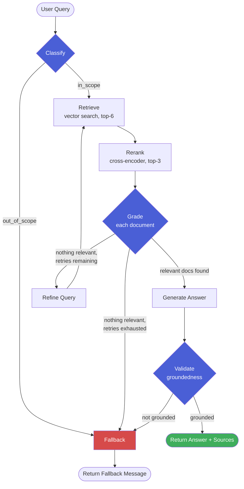

<div align="center">


[](https://github.com/nilay007hckkr/Minty/actions/workflows/ci.yml)


</div>

## What this is

A banking-FAQ chatbot that answers **only** from a bank's own published content, using an **agentic corrective-RAG pipeline** instead of a single retrieve-then-generate chain. It doesn't just fetch documents and hope for the best — it classifies whether a query is even in scope, reranks retrieved candidates with a cross-encoder, grades each document's relevance individually, rewrites and retries the search when nothing relevant comes back, and fact-checks its own generated answer against the source material before ever showing it to a user.

Every one of those steps exists because a simpler version of this system was tested against real (if synthetic) banking content and found to have a real failure mode — not because a tutorial said to add it.

## Table of contents

- [Why this isn't naive RAG](#why-this-isnt-naive-rag)
- [Architecture](#architecture)
- [Tech stack](#tech-stack)
- [Features](#features)
- [Project structure](#project-structure)
- [Getting started](#getting-started)
- [Usage](#usage)
- [Observability](#observability)
- [Evaluation](#evaluation)
- [Known limitations](#known-limitations)
- [Roadmap](#roadmap)

## Why this isn't naive RAG

A plain RAG chain is: embed query → vector search → stuff top-k into a prompt → generate. That's fast to build and fails silently in ways that matter for something answering questions about money:

- It can't tell "irrelevant document I happened to retrieve" from "genuinely relevant document" — so noisy top-k results end up cited as sources for facts they don't support.
- It has no fallback when retrieval simply misses — it just generates from whatever came back, relevant or not.
- It has no check on the generated answer itself — an LLM can (and did, during development of this project) invent a plausible-sounding but unsupported detail, like expanding an abbreviation the source never defined.

This project's graph adds a corrective step for each of those failure modes, and each one was validated against a real, reproduced failure — not added speculatively.

## Architecture



Retry cap on the refine loop: 2 attempts before falling back, enforced both by application logic and a hard `recursion_limit` on the graph itself as a safety net. Every node in this diagram is individually visible as a nested span in LangSmith — see [Observability](#observability).

## Tech stack

<div align="center">


</div>

| Layer | Choice | Why |
|---|---|---|
| Orchestration | LangGraph | Only framework here that natively supports the classify→retrieve→grade→**loop back**→generate→validate cycle; a linear chain can't express the refine loop at all. |
| Generation LLM | Groq (`openai/gpt-oss-120b`) | Fast inference, generous free tier for a portfolio-scale demo. |
| Utility LLM | Groq (`openai/gpt-oss-20b`) | Cheaper/faster model for classify, grade, and refine — these are cheap decisions that don't need the bigger model. |
| Embeddings | `sentence-transformers/all-MiniLM-L6-v2` | Runs locally, no API cost or rate limit — important since embeddings get called on every query and every semantic-cache check. |
| Reranker | `cross-encoder/ms-marco-MiniLM-L-6-v2` | Cross-encoders score query+document jointly for higher precision than vector similarity alone, used to cut top-6 candidates down to top-3 before grading. |
| Vector store | Chroma | Local, zero external services, good fit for a demo-scale corpus. |
| Cache / sessions / rate limiting | Redis | Fast in-memory structures fit all three needs: lists (history), key-value with TTL (semantic cache), and counters (rate limiting). |
| Observability | LangSmith | Auto-instruments every LangGraph node as a nested trace — no manual span wrapping needed, just environment variables. |

## Features

- [x] Two-stage markdown-aware chunking (header-based splitting, then size-based, preserving Q&A structure and source metadata)
- [x] Query classification (in-scope vs. out-of-scope) before any retrieval work happens
- [x] Cross-encoder reranking between retrieval and grading
- [x] Per-document LLM relevance grading (not a single batch judgment)
- [x] Query refinement + retry loop on failed retrieval, capped at 2 attempts
- [x] Post-generation groundedness validation — checks the generated answer's claims against the retrieved sources, not just whether retrieval succeeded
- [x] Redis-backed chat history, semantic response caching, and per-session rate limiting
- [x] Full LangSmith tracing — every graph node visible as a nested span, tagged per session
- [x] Minimal same-origin HTML chat UI served via FastAPI static mount
- [x] Dockerized (FastAPI + Redis via Compose)
- [x] pytest suite with mocked LLM calls (fast, free, CI-safe) + a separate live eval harness (real API calls, run manually)
- [x] GitHub Actions CI (tests + Docker build on every push)

## Project structure

```
app/
  main.py          FastAPI app: /chat, /health, rate limiting, semantic cache, trace metadata
  state.py         GraphState TypedDict shared across all graph nodes
  prompts.py       All prompt templates (classify, grade, refine, generate, validate)
  nodes.py         Node implementations + per-node error handling
  graph.py         StateGraph wiring: nodes, edges, conditional routing
  vectorstore.py   Embeddings + Chroma setup, idempotent indexing
  ingestion.py     Markdown loading + two-stage chunking
  rerank.py        Cross-encoder reranking
  history.py       Redis chat history (RPUSH / LRANGE)
  cache.py         Redis semantic cache (embedding similarity, shared across sessions)
  rate_limit.py    Redis fixed-window rate limiting
  redis_client.py  Shared Redis connection (host/port from env, for Docker networking)
static/
  index.html       Minimal chat UI
sample_data/       Sample banking FAQ content (ATM fees, accounts, cards, wire transfers)
tests/
  test_graph.py    Mocked-LLM unit tests (no network calls)
  eval_set.json    Hand-built eval questions + expected outcomes
  run_eval.py      Live eval harness (hits the real API, real Groq calls)
.github/workflows/
  ci.yml           pytest + Docker build on push/PR
Dockerfile
docker-compose.yml
```

## Getting started

```bash
git clone https://github.com/nilay007hckkr/Minty.git
cd Minty
cp .env.example .env   # add your GROQ_API_KEY (and optionally LANGSMITH_API_KEY, see below)
```

**With Docker (recommended):**
```bash
docker compose up --build
```

**Locally:**
```bash
uv sync
docker run -d --name minty-redis -p 6379:6379 redis:7-alpine
uv run python -m app.vectorstore   # first-time indexing
uv run uvicorn app.main:app
```

Either way, open `http://localhost:8000/static/index.html` for the chat UI, or `http://localhost:8000/docs` for the API.

**Optional — enable tracing:** add to `.env`:
```
LANGSMITH_TRACING=true
LANGSMITH_ENDPOINT=https://api.smith.langchain.com
LANGSMITH_API_KEY=your-langsmith-key
LANGSMITH_PROJECT=minty-banking-assistant
```
> Note the `LANGSMITH_*` naming, not the older `LANGCHAIN_*` variables some LangChain docs and tutorials still reference — an outdated version of these variable names caused a real, reproducible startup hang during development (see [Known limitations](#known-limitations)). If tracing isn't showing up, this naming is the first thing to check.

## Usage

```bash
curl -X POST http://localhost:8000/chat \
  -H "Content-Type: application/json" \
  -d '{"query": "what is the daily ATM withdrawal limit", "session_id": "demo-1"}'
```

```json
{
  "answer": "The daily ATM withdrawal limit depends on the type of account you have: Standard checking accounts: $1,000 per day, Premium and Wealth Management accounts: $2,500 per day...",
  "sources": ["sample_data/FAQ.md"],
  "cached": false
}
```

## Observability

Every `/chat` request is tagged with the session ID and traced end-to-end in LangSmith — the full `classify → retrieve → rerank → grade (× N documents) → refine (if needed) → generate → validate` sequence appears as a nested run, each step showing its exact prompt, response, and latency.

This isn't cosmetic — it directly replaces a debugging workflow this project relied on for most of its development: manually reading raw `DEBUG:`-level HTTP logs line by line to figure out which node ran, in what order, with what input. That worked, but a single ambiguous trace could take a dozen back-and-forth messages to fully diagnose. A trace viewer answers "what actually happened on this request" in one screenshot.

## Evaluation

**12/12** on a hand-built 12-question set covering all four sample FAQ topics plus four deliberately out-of-scope queries.

Two things worth calling out honestly rather than just quoting the number:

- One case (`"how do I open a new checking account"`) is scored as a correct **fallback**, not a direct answer — the groundedness validator rejected the model's first generation attempt as insufficiently grounded and declined rather than risk an inaccurate answer. That's the safety mechanism firing on real data, not a gap.
- The eval harness itself had a bug during development: naive substring keyword matching failed on markdown-formatted answers (e.g. `does **not** charge` doesn't literally contain `does not charge`). Fixed by stripping markdown before matching — a good reminder that a "failing" eval result is sometimes a bug in the test, not the system.

Run it yourself: `uv run python tests/run_eval.py` (requires the server running and a real Groq key — this makes live API calls, unlike the pytest suite).

## Known limitations

- **Semantic cache is shared, not session-scoped.** Deliberate: the content is universal factual information (fee schedules, hours), so caching across all users maximizes hit rate. This would be the wrong design the moment the system needed to answer anything account-specific or personalized.
- **`langchain-community` is being sunset** upstream (loaders are migrating to standalone integration packages). Seen, understood, and deliberately not migrated for a project at this scale.
- **Generation/validation can be sensitive to unusual query phrasing**, even when the underlying content exists — a vaguely-phrased question can occasionally trip the groundedness validator into declining an answer a more precisely-phrased version would pass.
- **Reranking trims retrieval to top-3 before grading**, which improves precision but can occasionally cost recall on borderline queries where the correct document doesn't survive the cut from 6 down to 3.
- **LangSmith env var naming caused a real, reproducible bug**: an outdated `LANGCHAIN_*` variable set produced silent `403 Forbidden` errors on trace uploads (app kept working, tracing silently failed); switching to the current `LANGSMITH_*` names fixed uploads, but briefly caused the container to hang on a slow cold start immediately after the change, which looked like a hard failure before a longer wait resolved it. Root-caused with container log inspection rather than assumed fixed or assumed broken — worth designing tracing setup with a startup timeout/healthcheck if this were headed to real production.

## Roadmap

- [ ] GitHub Actions step to also run the live eval harness on a schedule (not every push, given API cost)
- [ ] Session-aware semantic caching if the assistant ever needs to handle account-specific queries
- [ ] LangSmith-based automated evaluators (currently the eval harness is a standalone script; LangSmith supports running evals as part of the traced pipeline itself)

